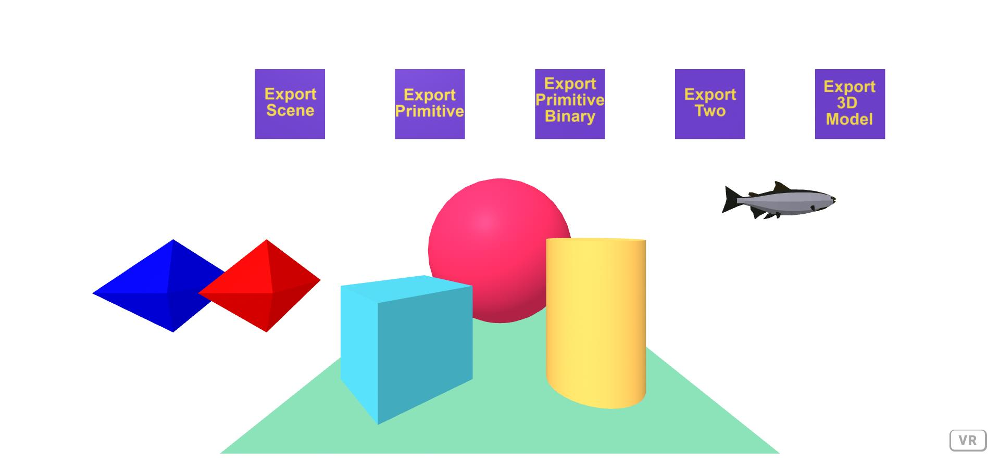

#A-Frame STL Exporter component (updated version)

### **Description / Rationale**
This is a small project, which demonstrates the working and updated version of AFrame STL Exporter Component, created by <a href="https://github.com/hassadee/aframe-stl-exporter-component">Hassadee Pimsuwan</a>, which is compatible with AFrame ver 1.3. Unfortunately latest version of the component is old and not compatible. 
This project also demonstrates the major functionality of the component, which includes:
- Exporting simple primitives (as binary and string)
- Exporting several primitives (as binary and string)
- Exporting 3D model (GLTF/GLB to binary or string).

### **Instructions**
To see the project at work just copy the repository to your local server and explore all the functionality. For reference, please see original <a href="https://github.com/hassadee/aframe-stl-exporter-component">AFrame STL Exporter Component.</a>

### **Tech Stack**
The project is powered by AFrame.

### **Demo**
To see the application at work: [Demo application](https://stl-exporter.glitch.me/)
